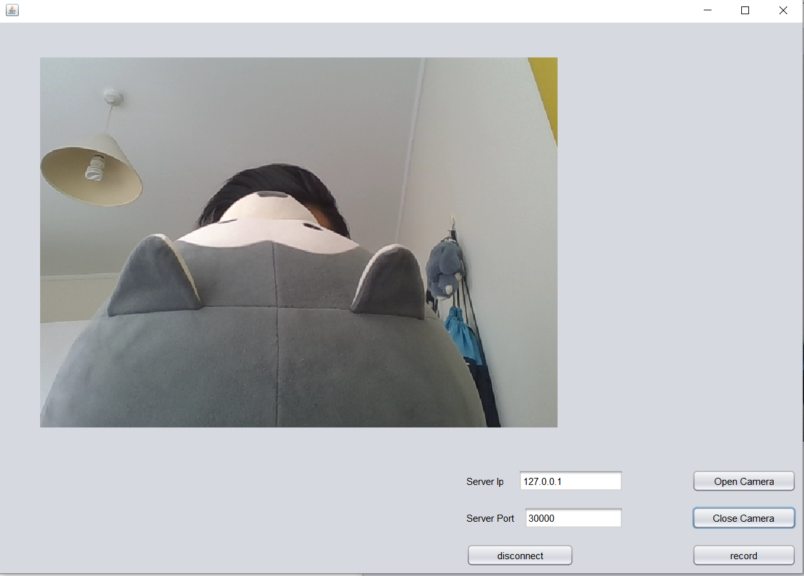

# WebCamStreamOnTCP_Netbeans_Java
This is a simple Netbeans Java project which implements stream video captured by web camera and recording. This is a similar project with project: https://github.com/WangSL777/WebCamStreamOnTCP_QT, which is implemented in QT platform using C++, while this project is implement in Netbeans using Java.




## File description:
- `webCamClient` folder contains Java source code and Netbeans project files for client. 
- `webCamServer` folder contains Java source code and Netbeans project files for server.

## Task background:
```
- Create a server that received video streams over a TCP/IP. Create a UI to control that server functionality which includes start/stop & record to file.
- Create a client that capture video using web cam and send the video stream over a TCP/IP to server. Create a UI to control that client functionality which includes start/stop & record to file.
```

## How to run:
To run executable files
- you need to download each release folder(`webCamClient/dist` and `webCamServer/dist`) which contains necessary .jar files. The recorded video files will be stored in the same directory where .jar files locates.
- In order for `webCamClient.jar` and `webCamServer.jar` to run successfully, you need to have opencv built on your platform. I have prepared one set of openCV built for Windows, please download using link: https://drive.google.com/drive/folders/1tfZnydmmCEu_lqJY4H6Gyq_Q6FFcUFkK?usp=sharing. If your computer cpu is 32 bit, you need to put `openCV_built/x86/opencv_java320.dll` under `dist/lib` folder together with opencv-320.jar files. Similarly, if your computer cpu is 64 bit, you need to put `openCV_built/x64/opencv_java320.dll` under `dist/lib` folder.
- After you have download all .jar files and necessary .dll files. You can run it using command: `java -Djava.library.path="lib" -jar "webCamClient.jar"`  and `java -Djava.library.path="lib" -jar "webCamServer.jar"`
